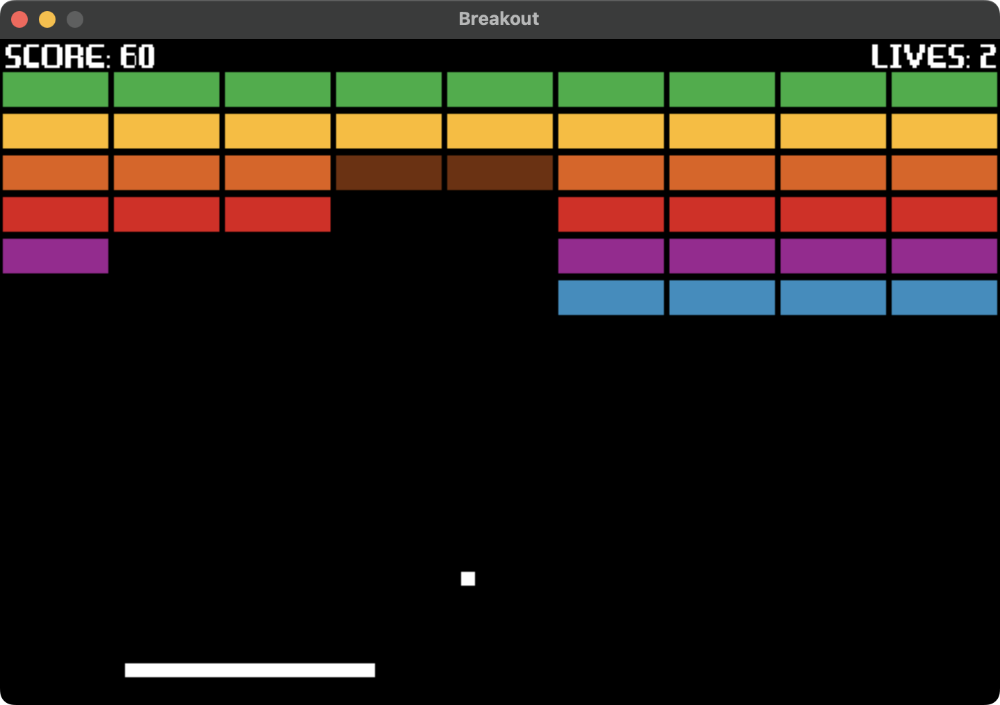

# Breakout

> Clone of the game 'Breakout' made in Pygame.



## Table of Contents

- [Requirements](#requirements)
- [Setup](#setup)

## Requirements

- Python version: `3.12`

## Setup

1. Make sure you have the required version of Python installed, and the git CLI.

2. Clone the repository.

    ```bash
    git clone https://github.com/TedAlden/breakout
    cd breakout/src
    ```

3. Install the required Python packages using pip.
    
    ```
    pip install -r requirements.txt
    ```

    > **Note**  
    > If your installation of pip is not added to your system PATH, you may need to instead run `python -m pip` or `python3 -m pip`.

4. Run the game using Python3.
    
    ```
    python3 main.py
    ```
